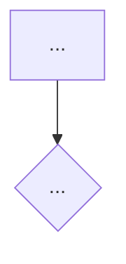

# <Domain name>

## 1. Change history

_(Each new row goes at the TOP of the table, don't delete old rows. Only
record changes that alter the flow in section 2 — adding/removing steps,
changing a rule, changing a domain link. Don't record behavior-neutral
refactors.)_

| Date       | Change                                               | Why        |
| ---------- | ---------------------------------------------------- | ---------- |
| YYYY-MM-DD | _(e.g. added a verify-discount step before pricing)_ | _(reason)_ |

## 2. Flow

_(Start with an endpoint table: method, path, whether auth is required
— connects the real HTTP route to the diagram below, since the diagram
usually starts from an internal function name, not a path. Then the
mermaid diagram — only shows steps and branches, no explaining why
inside the diagram. If the domain has multiple independent flows
(create/cancel/update...), split into multiple small diagrams, each with
a short heading.)_

| Method | Path             | Auth       |
| ------ | ---------------- | ---------- |
| POST   | `/v1/api/<path>` | _(yes/no)_ |

Diagram notation, consistent across every file using this template:
`flowchart TD` by default; `LR` only for a strictly linear state chain
(e.g. `pending --> confirmed --> shipped`) or a top-level cross-domain
overview. Decision nodes use `{}`, action nodes use `[]`. Error-outcome
nodes are always labeled `E1`, `E2`, `E3`... in the order they appear,
regardless of what other nodes in the same diagram are called. A node
label needing a line break must be quoted with ` `
(`Node["line one line two"]`) — a bare `\n` inside `[...]` renders
literally instead of breaking the line in most viewers.

## 3. Notes

_(Anything that can't be understood just by looking at the diagram in
section 2 — invariants, mandatory ordering, design trade-offs, known
inconsistencies, TODOs, limitations. Don't repeat what's already clear
in the diagram.)_

- ...

## 4. Links and references

_(Related code files — list plainly, no explanation. Include which
domain calls BACK into this domain — something that can't be read from
this domain's own internal diagram in section 2. Don't repeat "what this
domain calls", that's already in the diagram.)_

- `src/services/<domain>.service.js`
- `src/models/repositories/<domain>.repo.js`
- `src/models/<domain>.model.js`
- `src/controllers/<domain>.controller.js`
- `src/routes/<domain>/index.js`

**Called by:**

- `<Other domain>` — _(when)_
