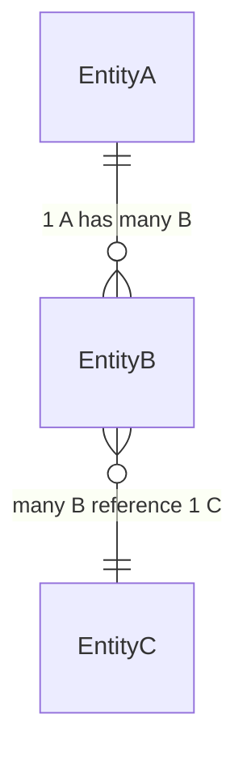

# Database

Standard for describing the schema — **don't repeat fields from the
model file**, field/type is already there (point to it, don't copy it).
This file only keeps the 2 things code can't say on its own: how the
schema changed over time, and how entities relate to each other.

Write at an abstract level: call it an "entity" (not
"collection"/"table"), a "reference" (not "foreign key"/"ref: ObjectId"
specific to one kind of DB) — so this document stays accurate even if
the database engine changes later.

## 1. Schema change history

_(Each new row goes at the TOP of the table, don't delete old rows —
this is a changelog, not a snapshot of the current state. Write at the
level of "what changed, why", not a specific migration script.)_

| Date       | Entity         | Change                                                 | Why                              |
| ---------- | -------------- | ------------------------------------------------------ | -------------------------------- |
| YYYY-MM-DD | `<EntityName>` | _(added field X / changed type Y / split entity Z...)_ | _(business or technical reason)_ |

## 2. Relationship diagram

_(1 mermaid `erDiagram` or `flowchart` for every entity in the system —
entity names + relationship type only, no fields. Update this file
whenever an entity is added/removed or a relationship changes, don't
wait to write it separately.)_

Which entity belongs to which business domain, see the matching file in
`docs/en/api/`.

## 3. Cross-entity invariants

_(Constraints the code must enforce itself — since a document-style
database usually can't enforce them the way tight relational
constraints do. Only record things at risk of breaking if the code gets
it wrong.)_

- ...
