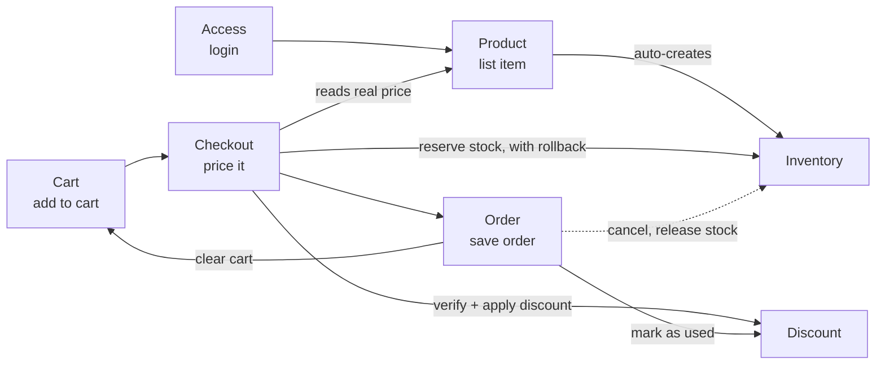

# Overview

## Overall diagram — how many domains 1 order passes through

Per-domain detail: [access.md](access.md), [product.md](product.md),
[inventory.md](inventory.md), [discount.md](discount.md),
[cart.md](cart.md), [checkout.md](checkout.md), [order.md](order.md),
[core.md](core.md).
