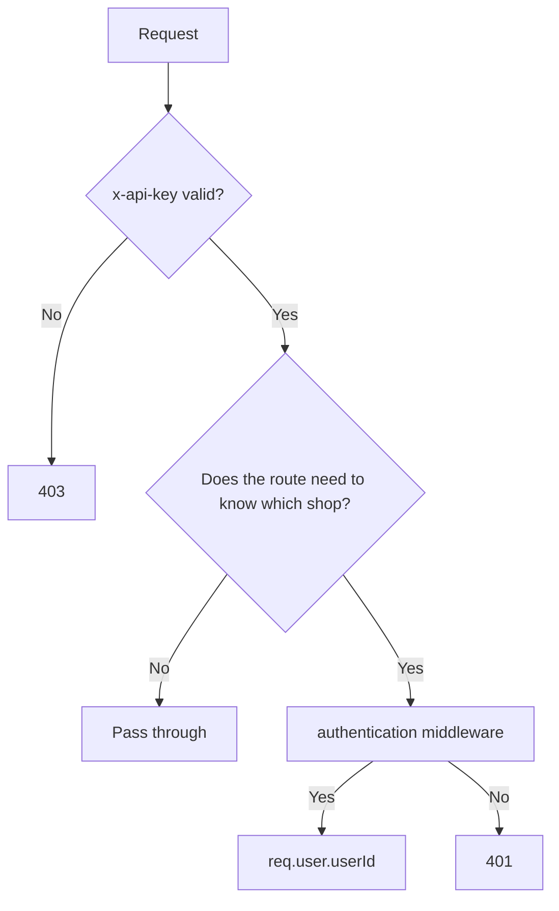
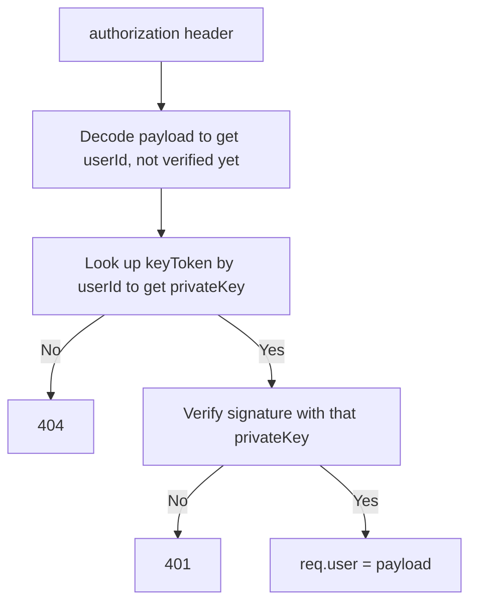
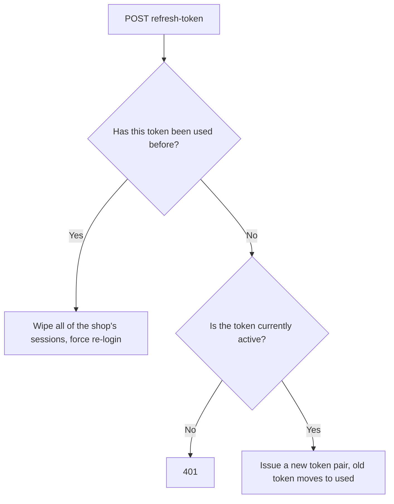

# Access (shop auth, JWT, api key)

## 1. Change history

| Date       | Change                                                                                        | Why                                                              |
| ---------- | --------------------------------------------------------------------------------------------- | ---------------------------------------------------------------- |
| 2026-08-13 | Added refresh token reuse detection (`refreshTokenUsed`), wipes the whole session if detected | Block the risk of a stolen refresh token being reused            |
| 2026-08-13 | Added `authentication` middleware verifying JWT against each shop's own `privateKey`          | Previously no middleware authenticated the specific caller       |
| 2026-08-12 | Switched from RSA keypair to `crypto.randomBytes` for `publicKey`/`privateKey`                | Simplification, RSA isn't needed for current requirements        |
| 2026-08-12 | Added `apiKey`/`permission` middleware, `ApiKey` model                                        | Needed a client-level auth layer (not shop-level) before the API |

## 2. Flow

| Method | Path                         | Auth                                  |
| ------ | ---------------------------- | ------------------------------------- |
| POST   | `/v1/api/shop/signup`        | no                                    |
| POST   | `/v1/api/shop/login`         | no                                    |
| POST   | `/v1/api/shop/logout`        | yes                                   |
| POST   | `/v1/api/shop/refresh-token` | no (reads refreshToken from the body) |
| POST   | `/v1/api/apikey`             | yes (requires `ADMIN` permission)     |

**Request authorization:**

**Verify JWT (`authentication` middleware):**

**Refresh token:**

## 3. Notes

- `x-api-key` and `authorization` are 2 independent layers: one
  identifies which client is allowed to call the API, the other
  identifies which specific shop is calling.
- JWT doesn't use one shared secret — each shop has its own
  `privateKey`, so the DB must be looked up by `userId` before the real
  signature can be verified.
- A new login generates a new `privateKey` and overwrites the old one →
  old tokens instantly stop being valid as soon as there's a new login,
  a shop can only have at most 1 live session at a time.
- Refresh token uses a rotation scheme: each token can only be used
  once; reusing an already-used token is treated as a sign of theft,
  the whole session gets revoked rather than trying to guess who's
  legitimate.
- `refreshToken`/`refreshTokenUsed` in `keyToken.model.js` are `Array`
  but in practice only 1 token is verifiable at a time (since
  `privateKey` gets overwritten on every login) — kept as an Array to
  make multi-device support easier to add later.
- `PERMISSIONS` (`src/constants/permission.js`): `READ:'0000'`,
  `WRITE:'1111'`, `ADMIN:'2222'`.

## 4. Links and references

- `src/services/access.service.js`
- `src/services/keyToken.service.js`
- `src/services/apiKey.service.js`
- `src/services/shop.service.js`
- `src/auth/authentication.js`
- `src/auth/checkAuth.js`
- `src/auth/authUtils.js`
- `src/models/shop.model.js`
- `src/models/keyToken.model.js`
- `src/models/apiKey.model.js`
- `src/routes/access/index.js`
- `src/routes/apiKey/index.js`

**Called by:** every other domain — through the `authentication`
middleware, every service uses `req.user.userId` as the identity of the
calling shop.
