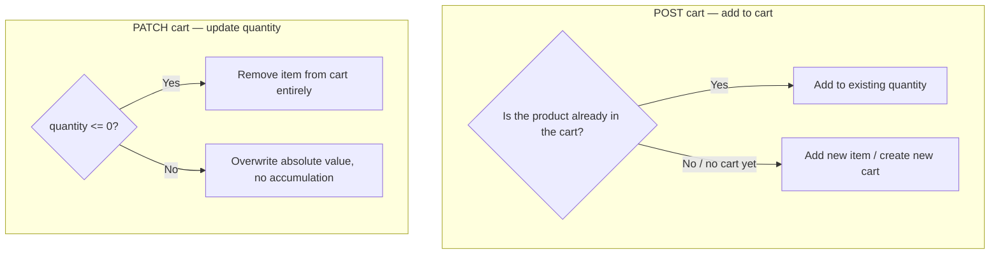

# Cart

## 1. Change history

| Date       | Change                                                                                                   | Why                                                                                                        |
| ---------- | -------------------------------------------------------------------------------------------------------- | ---------------------------------------------------------------------------------------------------------- |
| 2026-08-19 | Added `deleteProductsFromCart`, called from Order after order creation                                   | Needed to clear purchased items from the cart, to avoid accidental repeat purchase                         |
| 2026-08-19 | Fixed `order.service.js` to cast `productId` to `String` before matching against the cart                | `cart_products.productId` is stored as a String, matching directly against an ObjectId failed to remove it |
| 2026-08-19 | Created `cart.model.js`, `createUserCart` (add to cart, cumulative), `updateCartQuantity` (absolute set) | Needed a cart before checkout                                                                              |

## 2. Flow

| Method | Path           | Auth |
| ------ | -------------- | ---- |
| POST   | `/v1/api/cart` | yes  |
| PATCH  | `/v1/api/cart` | yes  |

## 3. Notes

- Add-to-cart and update-quantity don't share the same logic:
  add-to-cart assumes the user is adding something new (reasonable to
  accumulate); update-quantity assumes the user is correcting a number
  they already see on screen (must overwrite absolutely, accumulating
  here would be wrong — changing "3" to "5" but ending up with "8" is a
  bug).
- `cart_products[].productId` is stored as a string (`String`). Any
  place matching it against `product._id` (an `ObjectId`) must cast to
  string first.
- `cart_state` has the enum `active/completed/failed/pending` but
  nowhere in the code ever changes it away from `active`. When Order
  creates an order, it only removes items from `cart_products`, it
  doesn't change `cart_state`.
- There's no direct view/delete-cart route — only add and update
  quantity.

## 4. Links and references

- `src/services/cart.service.js`
- `src/models/repositories/cart.repo.js`
- `src/models/cart.model.js`
- `src/routes/cart/index.js`

**Called by:**

- `Checkout` — calls `cart.repo.js#findCartByUserId` directly (bypassing
  the service) — takes `cart._id` to use as `cartId` when reserving stock
- `Order` — calls `cart.repo.js#deleteProductsFromCart` directly —
  clears purchased items from the cart after creating the order
