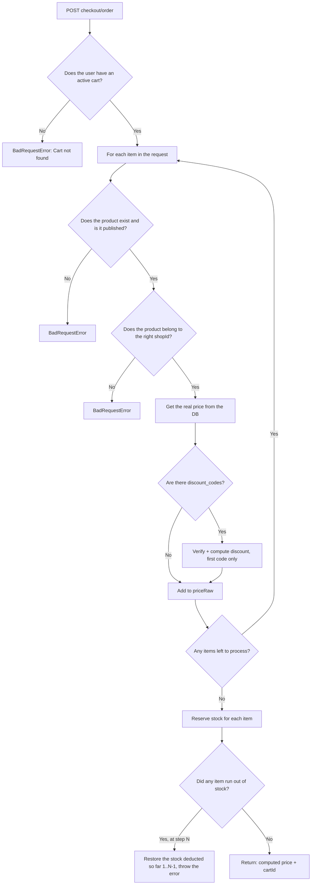

# Checkout

## 1. Change history

| Date       | Change                                                                 | Why                                                                                             |
| ---------- | ---------------------------------------------------------------------- | ----------------------------------------------------------------------------------------------- |
| 2026-08-19 | Added `checkoutOrder` (real stock reservation + partial rollback)      | `checkoutReview` only prices things, needed a step that actually holds stock before Order saves |
| 2026-08-19 | Created `checkoutReview` — prices using real DB data, applies discount | Needed a step to preview the price before ordering, without trusting the client's price         |

## 2. Flow

| Method | Path                      | Auth |
| ------ | ------------------------- | ---- |
| POST   | `/v1/api/checkout/review` | yes  |
| POST   | `/v1/api/checkout/order`  | yes  |

`checkout/review` runs exactly branch A→K then stops — it never touches
the stock-reservation step (L onward).

## 3. Notes

- Never trusts client-supplied data (price, item name) — always looks it
  up again in the DB (step G), to prevent the client from tampering with
  the price before sending the request.
- `checkoutOrder` re-runs the entire pricing flow from scratch, even if
  the client just called `/review` a second ago — no caching, to avoid a
  stale price (item just repriced, discount just expired) slipping into
  the real order.
- Partial rollback: if one item runs out of stock partway through, every
  item successfully reserved before it is restored immediately — an
  order never ends up in a "half-deducted" state.
- Only `discount_codes[0]` is used for pricing here, but Order (the next
  step) marks the entire array as used — see
  [order.md](order.md#mismatch-discount).
- Doesn't check whether the items in the request are actually in the
  cart — as long as the user has at least 1 active cart, checkout works,
  even with items never added to cart.

## 4. Links and references

- `src/services/checkout.service.js`
- `src/controllers/checkout.controller.js`
- `src/routes/checkout/index.js`

No dedicated model/repo — Checkout saves nothing, it only computes.

**Called by:**

- `Order` — `checkoutOrder` — the first step of `orderByUser`
