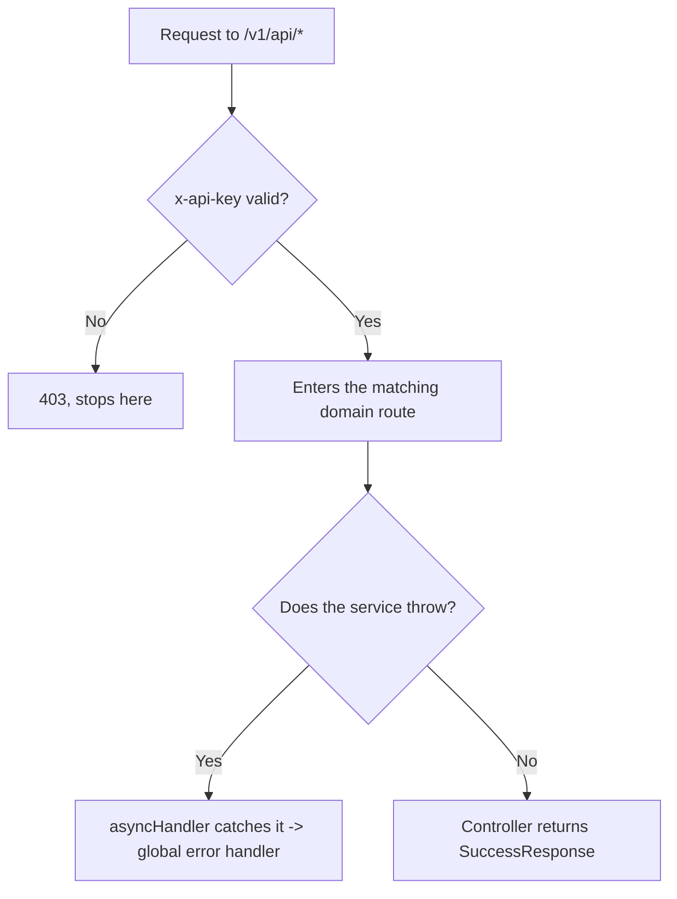

# Core infra

## 1. Change history

| Date       | Change                                                                     | Why                                                           |
| ---------- | -------------------------------------------------------------------------- | ------------------------------------------------------------- |
| 2026-08-16 | Split `ErrorResponse`/`SuccessResponse` into subclasses per HTTP status    | Previously every service wrote its own response, inconsistent |
| 2026-08-13 | Created `statusCode.js` — internal 4-digit codes separate from HTTP status | Needed a business code independent of the HTTP standard       |
| 2026-08-12 | Attached the `apiKey` middleware globally in `routes/index.js`             | Previously applied per individual route, easy to miss one     |

## 2. Flow

| Method | Path      | Auth                                    |
| ------ | --------- | --------------------------------------- |
| GET    | `/health` | no (the only route that skips `apiKey`) |

## 3. Notes

- Every error carries **2 different codes**: `httpStatus` (HTTP
  standard, 400/401/...) and `code` (internal 4-digit string, e.g.
  `'4000'`) — 2 independent values, mistaking one for the other leads to
  misreading the response.
- `apiKey` is attached at the `routes/index.js` layer, running before
  every domain — meaning code inside each domain can assume `x-api-key`
  is already valid, no need to check it again.
- `/health` is the only route that doesn't go through the `apiKey`
  middleware.
- There's no `inventory` route — see [inventory.md](inventory.md).

## 4. Links and references

- `src/core/error.response.js`
- `src/core/success.response.js`
- `src/utils/statusCode.js`
- `src/utils/index.js`
- `src/routes/index.js`
- `src/helpers/asyncHandler.js`
- `src/auth/checkAuth.js` (the `apiKey` middleware)

**Called by:** every domain (Access, Product, Inventory, Discount, Cart,
Checkout, Order) — every service throws through `ErrorResponse`, every
controller returns through `SuccessResponse`, every route goes through
the `apiKey` middleware before reaching the domain.
