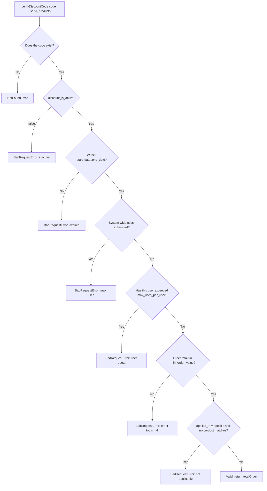

# Discount

## 1. Change history

| Date       | Change                                                                                                                                                                | Why                                                                                      |
| ---------- | --------------------------------------------------------------------------------------------------------------------------------------------------------------------- | ---------------------------------------------------------------------------------------- |
| 2026-08-19 | Added `applyDiscountCode`, called from Order after order creation                                                                                                     | `verifyDiscountCode`/`getDiscountAmount` previously never actually marked a code as used |
| 2026-08-18 | Created `discount.model.js`, `createDiscountCode`, `verifyDiscountCode`, `getDiscountAmount`, `getAllDiscountCodesByShop`, `deleteDiscountCode`, `cancelDiscountCode` | Needed discount codes scoped per shop                                                    |

## 2. Flow

| Method | Path                            | Auth |
| ------ | ------------------------------- | ---- |
| POST   | `/v1/api/discount`              | yes  |
| POST   | `/v1/api/discount/amount`       | yes  |
| GET    | `/v1/api/discount`              | yes  |
| POST   | `/v1/api/discount/verify`       | yes  |
| DELETE | `/v1/api/discount/:code`        | yes  |
| POST   | `/v1/api/discount/:code/cancel` | yes  |

`getDiscountAmount` = runs the flow above then computes the discount
amount (`fixed_amount` or `percentage` of `totalOrder`).
`applyDiscountCode` = increments `discount_uses_count`, pushes `userId`
into `discount_users_used` — does not re-run the verify flow above.

## 3. Notes

- Verify and apply are split into 2 separate functions: verify gets
  called repeatedly (every time a user views their cart) without
  actually consuming a real use; only `applyDiscountCode` (called
  exactly once, after the order is saved) actually consumes a use.
- `applyDiscountCode` doesn't re-verify — it trusts the caller already
  verified. Any domain that calls this function directly while skipping
  verify will let a code be used beyond its limits without error.
- `cancelDiscountCode` (controller) gets `shopId` from `req.body`,
  unlike every other function in the same controller (which all get it
  from `req.user.userId`).
- Checkout only prices using `discount_codes[0]`, but Order marks the
  entire array as used — see
  [order.md](order.md#mismatch-discount).

## 4. Links and references

- `src/services/discount.service.js`
- `src/models/repositories/discount.repo.js`
- `src/models/discount.model.js`
- `src/controllers/discount.controller.js`
- `src/routes/discount/index.js`

**Called by:**

- `Checkout` — `getDiscountAmount` — during review/order creation, only
  uses `discount_codes[0]`
- `Order` — `applyDiscountCode` — after the order is successfully
  created, loops over the entire `discount_codes` array
