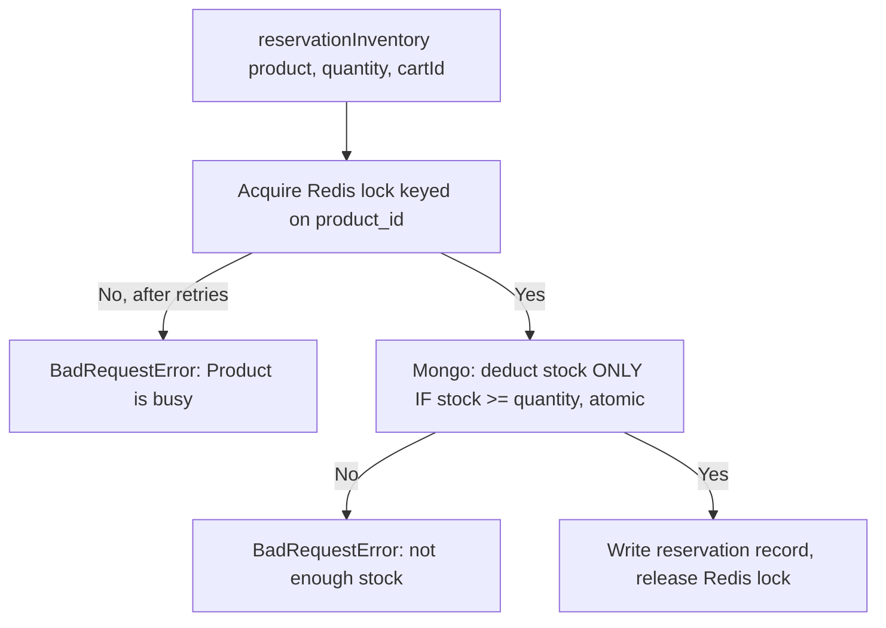

# Inventory

## 1. Change history

| Date       | Change                                                                                             | Why                                                                                                         |
| ---------- | -------------------------------------------------------------------------------------------------- | ----------------------------------------------------------------------------------------------------------- |
| 2026-08-19 | Added a Redis lock (`redisLock.js`) before deducting stock                                         | Mongo's atomic condition is safe enough for 1 instance, but a shared lock is needed across multiple servers |
| 2026-08-17 | Added `releaseInventory` (restore stock)                                                           | Needed to restore stock on checkout rollback and on order cancellation                                      |
| 2026-08-17 | Created `inventory.model.js`, `reservationInventory` with the atomic condition `stock >= quantity` | Needed a mechanism to reserve stock without overselling under concurrent requests                           |

## 2. Flow

`releaseInventory` (restore stock): adds `quantity` back, removes the
reservation record matching `cartId` — does not go through the Redis
lock.

## 3. Notes

- Deducting stock has 2 layers of protection stacked because this is
  the only place with a risk of overselling under concurrent requests:
  - **Redis lock** (proactive, request permission before doing
    anything) — needed when multiple servers run in parallel, since a
    Redis lock is shared across machines while a Mongo transaction on
    one machine isn't.
  - **Atomic condition in Mongo** (reactive, self-detects at write time)
    — the final safety net, correct whether or not the Redis lock
    errors out or expires.
- Restoring stock doesn't need a lock because adding a quantity back is
  always safe, with no race-condition risk like deducting has.
- `inventory_reservations` is a generic `Array`, no strict sub-schema —
  each element is `{quantity, cartId, createdOn}`.
- The Redis lock has a 10s TTL, up to 10 retries 50ms apart.

## 4. Links and references

- `src/services/inventory.service.js`
- `src/models/repositories/inventory.repo.js`
- `src/models/inventory.model.js`
- `src/helpers/redisLock.js`

No dedicated controller/route — this domain isn't exposed over HTTP
directly, it's only called internally by other domains (except for the
`/product/inventory/reservation` route on Product).

**Called by:**

- `Product` — `addStockToInventory` (on product creation),
  `reservationInventory` (via the manual reserve route)
- `Checkout` — `reservationInventory`, `releaseInventory` (on rollback)
- `Order` — `releaseInventory` (on order cancellation)
