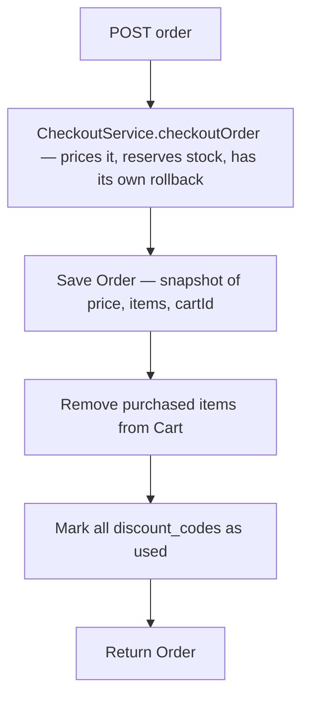
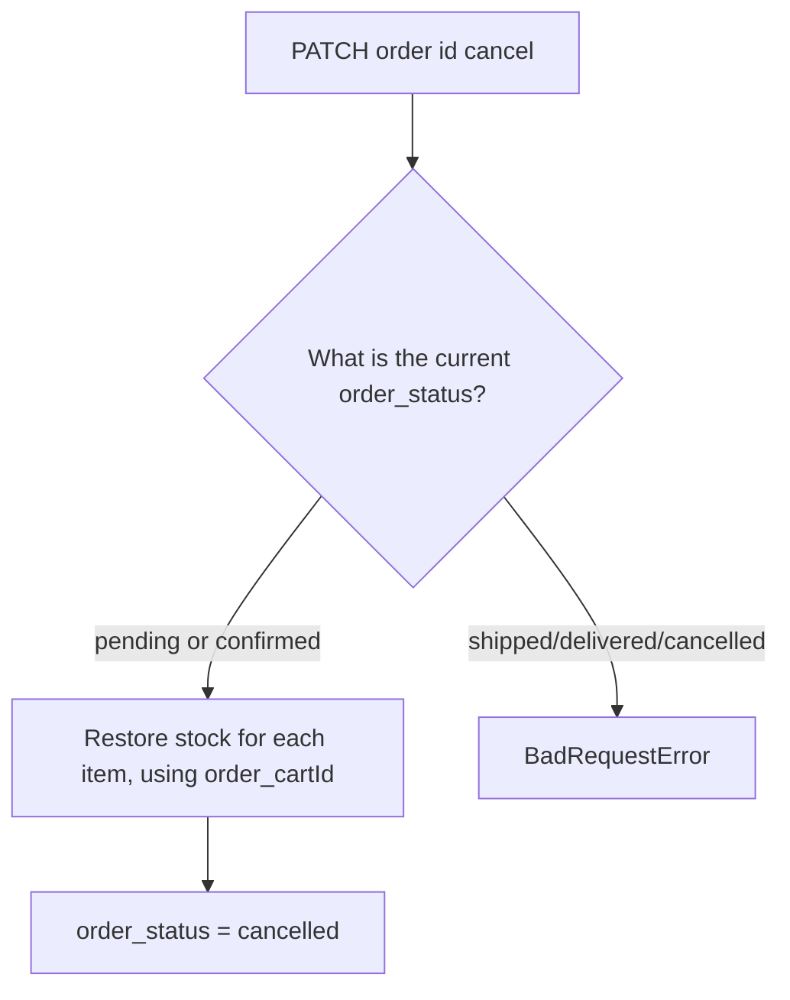
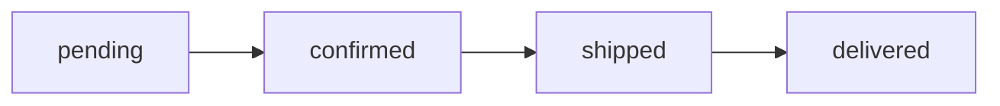

# Order

## 1. Change history

| Date       | Change                                                                                             | Why                                                                          |
| ---------- | -------------------------------------------------------------------------------------------------- | ---------------------------------------------------------------------------- |
| 2026-08-19 | Added `updateOrderStatus` (pending→confirmed→shipped→delivered, no skipping)                       | Needed to track order shipping progress                                      |
| 2026-08-19 | Added `cancelOrder` — restores stock, only allowed while `pending`/`confirmed`                     | Orders created before this had no way to cancel, stock was held forever      |
| 2026-08-19 | Created `order.model.js`, `orderByUser` (calls Checkout, saves Order, clears Cart, marks Discount) | This is the step that actually saves the order, completing the purchase flow |

## 2. Flow

| Method | Path                       | Auth |
| ------ | -------------------------- | ---- |
| POST   | `/v1/api/order`            | yes  |
| GET    | `/v1/api/order`            | yes  |
| GET    | `/v1/api/order/:id`        | yes  |
| PATCH  | `/v1/api/order/:id/cancel` | yes  |
| PATCH  | `/v1/api/order/:id/status` | yes  |

**Create order:**

**Cancel order:**

**Status transition:**

## 3. Notes {#mismatch-discount}

- Stock must be reserved **successfully first**, then Order is saved —
  if Order were saved first and stock reservation failed afterward,
  there would be a "ghost" order with no real stock behind it.
- Can only cancel while `pending`/`confirmed` — once `shipped`/
  `delivered`, the goods have physically left the warehouse, cancelling
  via the API no longer makes business sense so it's blocked at the
  service layer.
- `updateOrderStatus` only allows moving to the exact next step in
  sequence, no skipping, no going back — `cancelled` is deliberately
  excluded from this chain since cancelling is a separate branch, split
  off from the normal shipping flow (a cancelled order will always
  reject any further `updateOrderStatus` call, this is intentional).
- **Discount mismatch**: Checkout computes the discount using
  `discount_codes[0]` (the first code), but Order marks the entire
  `discount_codes` array as used. If the client sends more than 1 code:
  the discount amount is only computed from the first code, but the
  usage count of the remaining codes still gets consumed even though
  they have no effect on the price.
- `order_status` has `'cancelled'` in the model enum but it's not part
  of the `updateOrderStatus` chain above (intentional, see above).

## 4. Links and references

- `src/services/order.service.js`
- `src/models/repositories/order.repo.js`
- `src/models/order.model.js`
- `src/controllers/order.controller.js`
- `src/routes/order/index.js`

**Called by:** no domain — this is the terminal point of the purchase
flow.
