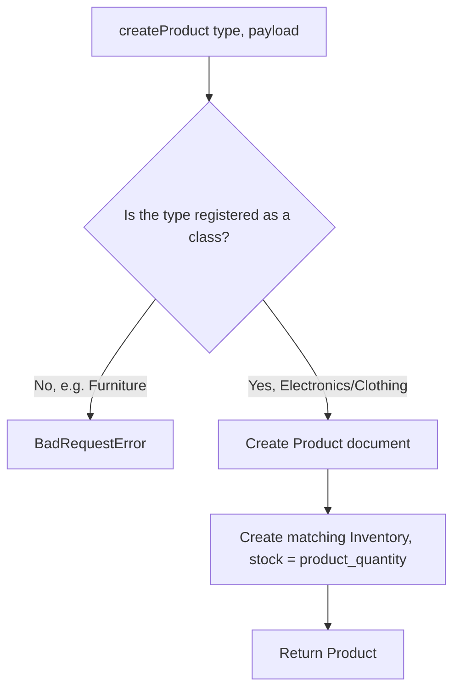
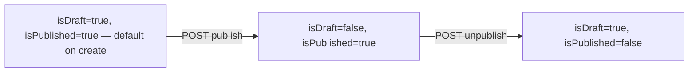

# Product

## 1. Change history

| Date       | Change                                                                                                             | Why                                                                   |
| ---------- | ------------------------------------------------------------------------------------------------------------------ | --------------------------------------------------------------------- |
| 2026-08-18 | Added `updateProduct` (PATCH)                                                                                      | Needed to edit a product after creation, not just create new ones     |
| 2026-08-18 | Added publish/unpublish, search, findAllProducts, findProduct                                                      | Completed the public product visibility lifecycle                     |
| 2026-08-18 | Changed `createProduct` to auto-call `InventoryService.addStockToInventory`                                        | A newly created product needs stock right away, avoid a separate call |
| 2026-08-17 | Created `product.model.js` using a Mongoose discriminator (Electronics, Clothing) + Factory pattern in the service | Multiple product types have their own fields but share one collection |

## 2. Flow

| Method | Path                                    | Auth |
| ------ | --------------------------------------- | ---- |
| POST   | `/v1/api/product`                       | yes  |
| PATCH  | `/v1/api/product/:id`                   | yes  |
| GET    | `/v1/api/product/draft/all`             | yes  |
| POST   | `/v1/api/product/publish/:id`           | yes  |
| POST   | `/v1/api/product/unpublish/:id`         | yes  |
| GET    | `/v1/api/product/search/:keySearch`     | no   |
| GET    | `/v1/api/product/all`                   | no   |
| GET    | `/v1/api/product/:id`                   | no   |
| POST   | `/v1/api/product/inventory/reservation` | yes  |

**Create product:**

**Publish state transition:**

## 3. Notes

- Creating a product always creates its Inventory in the same flow — not
  a separate step, because a product with no stock can't be sold.
- `isDraft` and `isPublished` don't exclude each other automatically —
  both default to `true` on creation, the `publish`/`unpublish` APIs
  must be called explicitly to sync them. Public APIs filter by
  `isPublished: true`, so a newly created product is actually already
  publicly visible even while `isDraft` is still `true`.
- `product_slug` is recomputed in `pre('save')` on every save — renaming
  a product auto-updates the slug, nothing else needs to be called.
- The `product_type` enum allows `'Furniture'` but there's no class
  handling that type yet — creating that type will always fail with
  "Invalid product type".
- `findProduct` (used by Checkout) only returns products with
  `isPublished:true` — even the owning shop can't see a draft through
  this path.

## 4. Links and references

- `src/services/product.service.js`
- `src/models/repositories/product.repo.js`
- `src/models/product.model.js`
- `src/controllers/product.controller.js`
- `src/routes/product/index.js`

**Called by:**

- `Checkout` — calls `product.repo.js#findProduct` directly (bypassing
  the service), to get the real price when reviewing/placing an order
