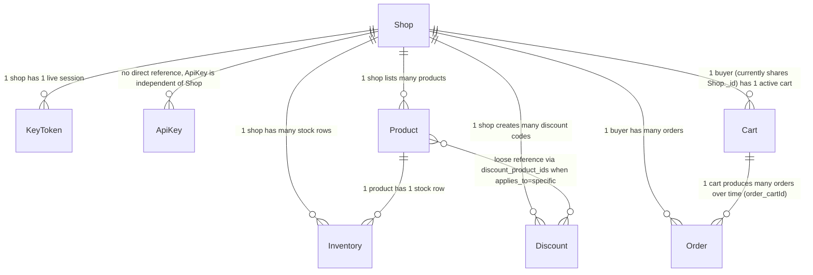

# Database

## 1. Schema change history

| Date       | Entity             | Change                                                                                         | Why                                                                               |
| ---------- | ------------------ | ---------------------------------------------------------------------------------------------- | --------------------------------------------------------------------------------- |
| 2026-08-19 | `Order`            | Added `order_cartId`                                                                           | Needed to keep the originating cart to restore stock to the right place on cancel |
| 2026-08-19 | `Inventory`        | Added `inventory_reservations[]`                                                               | Needed to track each reservation by `cartId` for partial rollback                 |
| 2026-08-18 | `Discount`         | Created new entity                                                                             | Needed to store discount codes scoped per shop                                    |
| 2026-08-17 | `Cart`             | Created new entity                                                                             | Needed a cart before checkout                                                     |
| 2026-08-17 | `Inventory`        | Created new entity                                                                             | Needed to track stock separately from `Product`                                   |
| 2026-08-17 | `Product`          | Split into a root entity + 2 child entities (Electronics, Clothing) sharing a common reference | Multiple product types have their own fields but need to be queried together      |
| 2026-08-13 | `KeyToken`         | Renamed entity from `Key` → `KeyToken`                                                         | The old name was too generic, unclear what it was for                             |
| 2026-08-12 | `ApiKey`           | Created new entity                                                                             | Needed a client-auth layer separate from Shop auth                                |
| 2026-08-11 | `Shop`, `KeyToken` | Created the first 2 entities                                                                   | Bootstrapped the signup/login flow                                                |

## 2. Relationship diagram

`ApiKey` doesn't reference `Shop` — it authenticates the calling client,
not tied to a specific shop (see [access.md](../api/access.md)).

Which entity belongs to which business domain, see the matching file in
`docs/en/api/`.

## 3. Cross-entity invariants

- `Cart.cart_userId` and `Order.order_userId` currently reference
  `Shop._id` — the system doesn't yet have a `User` entity split off
  from `Shop` (buyer and seller currently share one entity). This field
  has no explicitly declared `ref` in the schema, it's purely a code
  convention that must be kept correct.
- `Order.order_cartId` must point to the `Cart` that produced that
  order — reused when cancelling an order to restore stock to the right
  `cartId`. No DB constraint enforces this field matches an existing
  `Cart`; if a `Cart` were deleted (current code never deletes a Cart),
  this reference would dangle.
- `Discount.discount_product_ids` only matters when
  `discount_applies_to = 'specific'` — no DB constraint enforces the
  array values are valid, existing `Product._id`s.
- `Inventory.inventory_reservations[].cartId` is not a formal reference
  to `Cart._id` via a typed `ObjectId` with `ref` — it's just a value
  used to group/look up when rolling back (`releaseInventory`), matched
  as a raw value.
