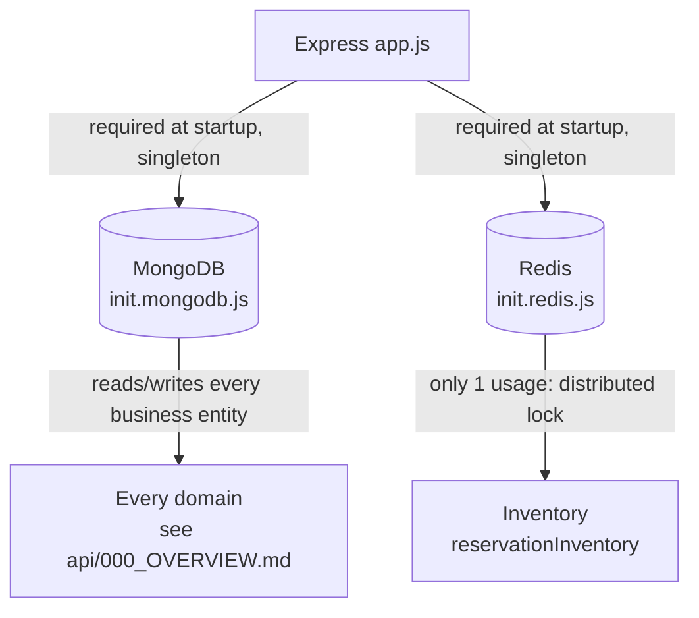

# Topology

## 1. Change history

| Date       | Change                                                          | Why                                                           |
| ---------- | --------------------------------------------------------------- | ------------------------------------------------------------- |
| 2026-08-19 | Added Redis to `app.js` (`init.redis`)                          | Needed a distributed lock for stock, see [redis.md](redis.md) |
| 2026-08-11 | MongoDB is the first infrastructure connection (`init.mongodb`) | Primary data store                                            |

## 2. Connection diagram

Which domain calls which domain at the business layer, see
[api/000_OVERVIEW.md](../api/000_OVERVIEW.md) — that
diagram differs from this one: this is infrastructure, that one is
business logic.

## 3. Notes

- Both connections are `require`d as soon as `app.js` loads (not lazy),
  in Mongo-before-Redis order — this order doesn't matter logically (2
  independent connections), it's just the order the code was written in.
- Redis currently has **only 1 usage point** in the whole system
  (`Inventory`) — not a broadly shared piece of infrastructure like
  MongoDB.
- There's no combined health-check verifying both connections at once —
  each connection logs its own status separately (see
  [mongodb.md](mongodb.md), [redis.md](redis.md)).

## 4. Links and references

- `src/app.js`
- `src/dbs/init.mongodb.js`
- `src/dbs/init.redis.js`
