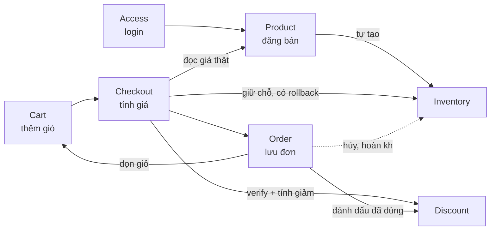

# Overview

## Sơ đồ tổng — 1 đơn hàng đi qua bao nhiêu domain

Chi tiết từng domain: [access.md](access.md), [product.md](product.md),
[inventory.md](inventory.md), [discount.md](discount.md),
[cart.md](cart.md), [checkout.md](checkout.md), [order.md](order.md),
[core.md](core.md).
