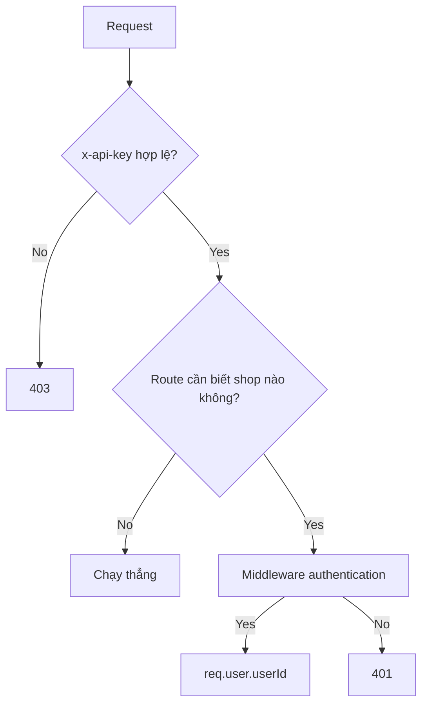
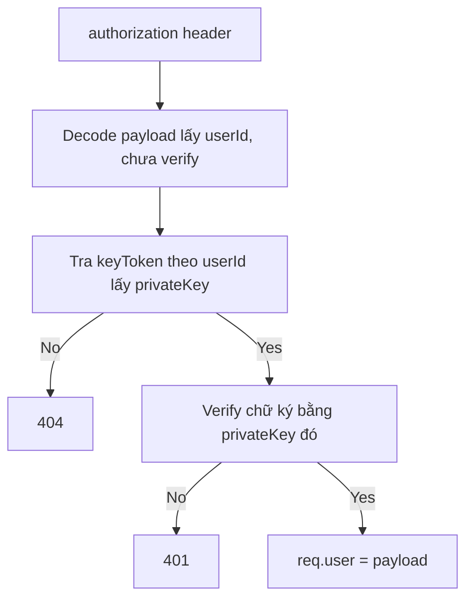
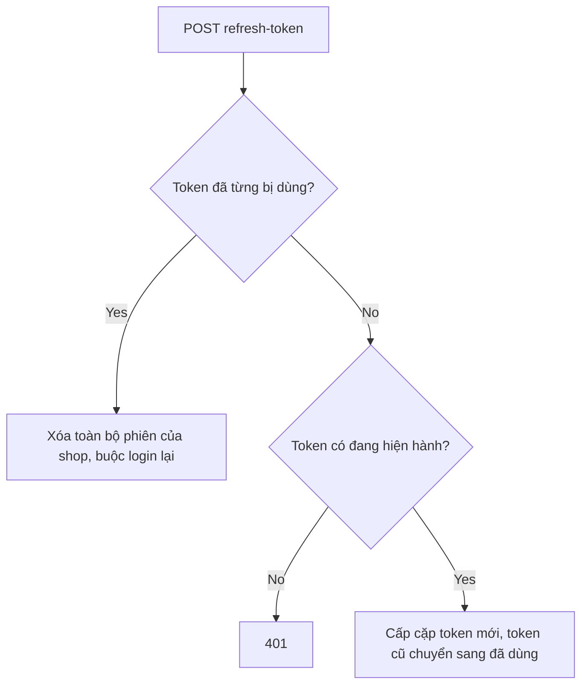

# Access (shop auth, JWT, api key)

## 1. Lịch sử thay đổi

| Ngày       | Thay đổi                                                                                       | Vì sao                                                      |
| ---------- | ---------------------------------------------------------------------------------------------- | ----------------------------------------------------------- |
| 2026-08-13 | Thêm phát hiện tái sử dụng refresh token (`refreshTokenUsed`), xóa toàn bộ phiên nếu phát hiện | Chặn nguy cơ refresh token bị đánh cắp và dùng lại          |
| 2026-08-13 | Thêm middleware `authentication` verify JWT theo `privateKey` riêng từng shop                  | Trước đó chưa có middleware xác thực người gọi cụ thể       |
| 2026-08-12 | Đổi từ RSA keypair sang `crypto.randomBytes` cho `publicKey`/`privateKey`                      | Đơn giản hóa, không cần RSA cho nhu cầu hiện tại            |
| 2026-08-12 | Thêm `apiKey`/`permission` middleware, model `ApiKey`                                          | Cần lớp xác thực client (không phải shop) trước khi vào API |

## 2. Luồng hoạt động

| Method | Path                         | Auth                                |
| ------ | ---------------------------- | ----------------------------------- |
| POST   | `/v1/api/shop/signup`        | không                               |
| POST   | `/v1/api/shop/login`         | không                               |
| POST   | `/v1/api/shop/logout`        | có                                  |
| POST   | `/v1/api/shop/refresh-token` | không (tự lấy refreshToken từ body) |
| POST   | `/v1/api/apikey`             | có (cần quyền `ADMIN`)              |

**Phân quyền request:**

**Verify JWT (`authentication` middleware):**

**Refresh token:**

## 3. Ghi chú

- `x-api-key` và `authorization` là 2 lớp độc lập: 1 xác định client được
  phép gọi API, 1 xác định shop cụ thể nào đang gọi.
- JWT không dùng 1 secret chung — mỗi shop có `privateKey` riêng, nên
  phải tra DB theo `userId` trước khi verify được chữ ký thật.
- Login mới sinh `privateKey` mới và ghi đè key cũ → token cũ tự hết hạn
  ngay khi có login mới, 1 shop chỉ có tối đa 1 phiên sống cùng lúc.
- Refresh token dùng cơ chế rotation: mỗi token chỉ dùng được 1 lần; dùng
  lại token đã dùng bị coi là dấu hiệu bị đánh cắp, khóa toàn bộ phiên
  thay vì cố đoán ai đúng ai sai.
- `refreshToken`/`refreshTokenUsed` trong `keyToken.model.js` là `Array`
  nhưng thực tế chỉ 1 token verify được tại 1 thời điểm (do `privateKey`
  bị ghi đè mỗi login) — giữ dạng Array để dễ mở rộng multi-device sau.
- `PERMISSIONS` (`src/constants/permission.js`): `READ:'0000'`,
  `WRITE:'1111'`, `ADMIN:'2222'`.

## 4. Liên kết và tham khảo

- `src/services/access.service.js`
- `src/services/keyToken.service.js`
- `src/services/apiKey.service.js`
- `src/services/shop.service.js`
- `src/auth/authentication.js`
- `src/auth/checkAuth.js`
- `src/auth/authUtils.js`
- `src/models/shop.model.js`
- `src/models/keyToken.model.js`
- `src/models/apiKey.model.js`
- `src/routes/access/index.js`
- `src/routes/apiKey/index.js`

**Được gọi bởi:** tất cả domain khác — thông qua middleware
`authentication`, mọi service dùng `req.user.userId` làm identity của
shop đang gọi.
