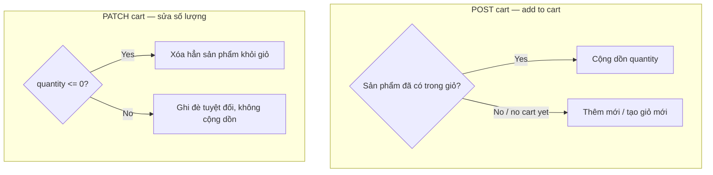

# Cart

## 1. Lịch sử thay đổi

| Ngày       | Thay đổi                                                                                            | Vì sao                                                                                   |
| ---------- | --------------------------------------------------------------------------------------------------- | ---------------------------------------------------------------------------------------- |
| 2026-08-19 | Thêm `deleteProductsFromCart`, gọi từ Order sau khi tạo đơn                                         | Cần dọn sản phẩm đã mua khỏi giỏ, tránh mua lại nhầm                                     |
| 2026-08-19 | Sửa `order.service.js` ép kiểu `productId` sang `String` trước khi so khớp cart                     | `cart_products.productId` lưu String, so trực tiếp với ObjectId không khớp, xóa không ra |
| 2026-08-19 | Tạo `cart.model.js`, `createUserCart` (add to cart, cộng dồn), `updateCartQuantity` (set tuyệt đối) | Cần giỏ hàng trước khi checkout                                                          |

## 2. Luồng hoạt động

| Method | Path           | Auth |
| ------ | -------------- | ---- |
| POST   | `/v1/api/cart` | có   |
| PATCH  | `/v1/api/cart` | có   |

## 3. Ghi chú

- Add-to-cart và update-quantity không dùng chung logic: add-to-cart giả
  định user đang thêm mới (hợp lý để cộng dồn); update-quantity giả định
  user đang sửa số đã thấy trên màn hình (phải ghi đè tuyệt đối, cộng dồn
  ở đây sẽ sai — sửa "3" thành "5" mà cộng dồn thành "8" là bug).
- `cart_products[].productId` lưu dạng chuỗi (`String`). Bất kỳ chỗ nào
  so khớp với `product._id` (kiểu `ObjectId`) phải ép kiểu về chuỗi
  trước khi so.
- `cart_state` có enum `active/completed/failed/pending` nhưng không có
  nơi nào trong code từng đổi nó khỏi `active`. Order tạo đơn xong chỉ
  xóa sản phẩm khỏi `cart_products`, không đổi `cart_state`.
- Không có route xem/xóa cart trực tiếp — chỉ add và update quantity.

## 4. Liên kết và tham khảo

- `src/services/cart.service.js`
- `src/models/repositories/cart.repo.js`
- `src/models/cart.model.js`
- `src/routes/cart/index.js`

**Được gọi bởi:**

- `Checkout` — gọi thẳng `cart.repo.js#findCartByUserId` (bỏ qua
  service) — lấy `cart._id` dùng làm `cartId` khi giữ chỗ tồn kho
- `Order` — gọi thẳng `cart.repo.js#deleteProductsFromCart` — dọn sản
  phẩm đã đặt khỏi giỏ sau khi tạo đơn
