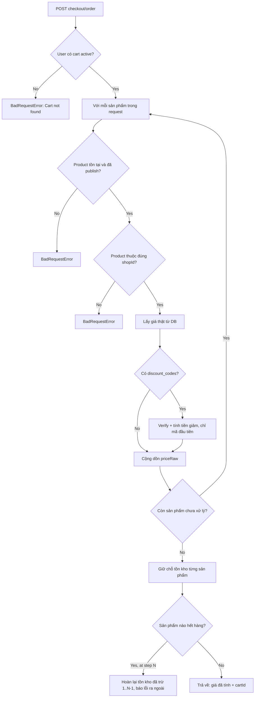

# Checkout

## 1. Lịch sử thay đổi

| Ngày       | Thay đổi                                                          | Vì sao                                                                           |
| ---------- | ----------------------------------------------------------------- | -------------------------------------------------------------------------------- |
| 2026-08-19 | Thêm `checkoutOrder` (giữ chỗ tồn kho thật + rollback từng phần)  | `checkoutReview` chỉ tính giá, cần bước thật sự giữ hàng trước khi Order lưu đơn |
| 2026-08-19 | Tạo `checkoutReview` — tính giá theo dữ liệu DB thật, áp discount | Cần 1 bước xem trước giá trước khi đặt hàng, không tin giá client gửi            |

## 2. Luồng hoạt động

| Method | Path                      | Auth |
| ------ | ------------------------- | ---- |
| POST   | `/v1/api/checkout/review` | có   |
| POST   | `/v1/api/checkout/order`  | có   |

`checkout/review` chạy đúng nhánh A→K rồi dừng — không đụng bước giữ chỗ
tồn kho (L trở đi).

## 3. Ghi chú

- Không tin dữ liệu client gửi (giá, tên sản phẩm) — luôn tra lại DB
  (bước G), tránh client tự sửa giá trước khi gửi request.
- `checkoutOrder` gọi lại toàn bộ luồng tính giá từ đầu, dù client vừa
  gọi `/review` xong giây trước — không cache, để tránh giá cũ (sản phẩm
  vừa đổi giá, discount vừa hết hạn) lọt vào đơn hàng thật.
- Rollback từng phần: nếu 1 sản phẩm hết hàng giữa chừng, mọi sản phẩm
  đã giữ chỗ thành công trước đó được hoàn lại ngay — đơn không bao giờ
  ở trạng thái "trừ nửa chừng".
- Chỉ `discount_codes[0]` được dùng để tính tiền ở đây, nhưng Order (bước
  sau) đánh dấu toàn bộ mảng là đã dùng — xem
  [order.md](order.md#mismatch-discount).
- Không kiểm tra sản phẩm trong request có thực sự nằm trong cart hay
  không — chỉ cần user có ít nhất 1 cart active là checkout được, kể cả
  với sản phẩm chưa từng add to cart.

## 4. Liên kết và tham khảo

- `src/services/checkout.service.js`
- `src/controllers/checkout.controller.js`
- `src/routes/checkout/index.js`

Không có model/repo riêng — Checkout không lưu gì cả, chỉ tính toán.

**Được gọi bởi:**

- `Order` — `checkoutOrder` — là bước đầu tiên trong `orderByUser`
