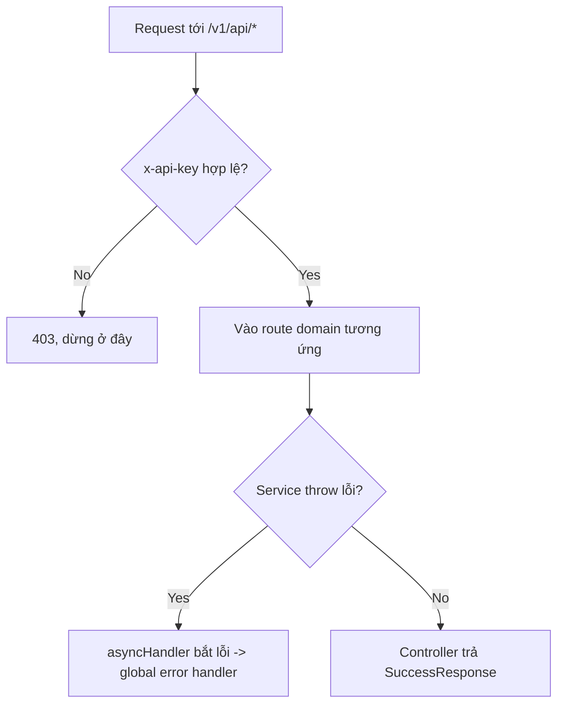

# Core infra

## 1. Lịch sử thay đổi

| Ngày       | Thay đổi                                                                      | Vì sao                                                 |
| ---------- | ----------------------------------------------------------------------------- | ------------------------------------------------------ |
| 2026-08-16 | Tách `ErrorResponse`/`SuccessResponse` thành nhiều class con theo HTTP status | Trước đó mỗi service tự viết response, không nhất quán |
| 2026-08-13 | Tạo `statusCode.js` — mã nội bộ 4 số tách biệt HTTP status                    | Cần mã nghiệp vụ riêng, không phụ thuộc chuẩn HTTP     |
| 2026-08-12 | Gắn middleware `apiKey` toàn cục ở `routes/index.js`                          | Trước đó chỉ áp cho từng route lẻ, dễ sót              |

## 2. Luồng hoạt động

| Method | Path      | Auth                                      |
| ------ | --------- | ----------------------------------------- |
| GET    | `/health` | không (route duy nhất không qua `apiKey`) |

## 3. Ghi chú

- Mỗi lỗi mang **2 mã khác nhau**: `httpStatus` (chuẩn HTTP, 400/401/...)
  và `code` (chuỗi nội bộ 4 số, ví dụ `'4000'`) — 2 giá trị độc lập, đọc
  nhầm cái này thành cái kia sẽ hiểu sai response.
- `apiKey` gắn ở tầng `routes/index.js`, chạy trước mọi domain — nghĩa là
  code bên trong từng domain có thể giả định `x-api-key` đã hợp lệ, không
  cần tự kiểm tra lại.
- `/health` là route duy nhất không qua middleware `apiKey`.
- Không có route `inventory` — xem [inventory.md](inventory.md).

## 4. Liên kết và tham khảo

- `src/core/error.response.js`
- `src/core/success.response.js`
- `src/utils/statusCode.js`
- `src/utils/index.js`
- `src/routes/index.js`
- `src/helpers/asyncHandler.js`
- `src/auth/checkAuth.js` (middleware `apiKey`)

**Được gọi bởi:** tất cả domain (Access, Product, Inventory, Discount,
Cart, Checkout, Order) — mọi service throw lỗi qua `ErrorResponse`, mọi
controller trả kết quả qua `SuccessResponse`, mọi route đi qua middleware
`apiKey` trước khi vào domain.
