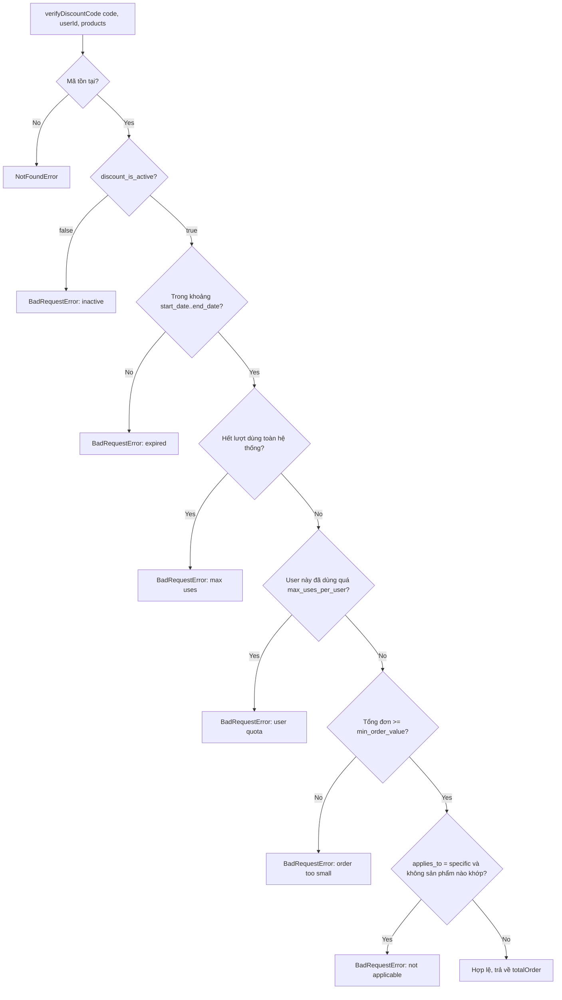

# Discount

## 1. Lịch sử thay đổi

| Ngày       | Thay đổi                                                                                                                                                          | Vì sao                                                                                         |
| ---------- | ----------------------------------------------------------------------------------------------------------------------------------------------------------------- | ---------------------------------------------------------------------------------------------- |
| 2026-08-19 | Thêm `applyDiscountCode`, gọi từ Order sau khi tạo đơn                                                                                                            | `verifyDiscountCode`/`getDiscountAmount` trước đó không có nơi nào thật sự đánh dấu mã đã dùng |
| 2026-08-18 | Tạo `discount.model.js`, `createDiscountCode`, `verifyDiscountCode`, `getDiscountAmount`, `getAllDiscountCodesByShop`, `deleteDiscountCode`, `cancelDiscountCode` | Cần mã giảm giá theo shop                                                                      |

## 2. Luồng hoạt động

| Method | Path                            | Auth |
| ------ | ------------------------------- | ---- |
| POST   | `/v1/api/discount`              | có   |
| POST   | `/v1/api/discount/amount`       | có   |
| GET    | `/v1/api/discount`              | có   |
| POST   | `/v1/api/discount/verify`       | có   |
| DELETE | `/v1/api/discount/:code`        | có   |
| POST   | `/v1/api/discount/:code/cancel` | có   |

`getDiscountAmount` = gọi luồng trên rồi tính tiền giảm (`fixed_amount`
hoặc `percentage` trên `totalOrder`). `applyDiscountCode` = cộng
`discount_uses_count`, push `userId` vào `discount_users_used` — không
gọi lại luồng verify ở trên.

## 3. Ghi chú

- Verify và áp dụng tách thành 2 hàm riêng: verify được gọi nhiều lần
  (mỗi lần user xem giỏ hàng) mà không hao hụt lượt dùng thật; chỉ
  `applyDiscountCode` (gọi đúng 1 lần, sau khi đơn đã lưu) mới thật sự
  trừ lượt.
- `applyDiscountCode` không tự verify lại — nó tin caller đã verify
  trước đó. Domain nào gọi thẳng hàm này mà bỏ qua verify sẽ khiến mã bị
  dùng vượt giới hạn mà không báo lỗi.
- `cancelDiscountCode` (controller) lấy `shopId` từ `req.body`, khác mọi
  hàm khác trong cùng controller (đều lấy từ `req.user.userId`).
- Checkout chỉ tính giá theo `discount_codes[0]`, nhưng Order đánh dấu
  toàn bộ mảng là đã dùng — xem [order.md](order.md#mismatch-discount).

## 4. Liên kết và tham khảo

- `src/services/discount.service.js`
- `src/models/repositories/discount.repo.js`
- `src/models/discount.model.js`
- `src/controllers/discount.controller.js`
- `src/routes/discount/index.js`

**Được gọi bởi:**

- `Checkout` — `getDiscountAmount` — lúc review/tạo đơn, chỉ dùng
  `discount_codes[0]`
- `Order` — `applyDiscountCode` — sau khi đơn tạo thành công, lặp qua
  toàn bộ `discount_codes`
