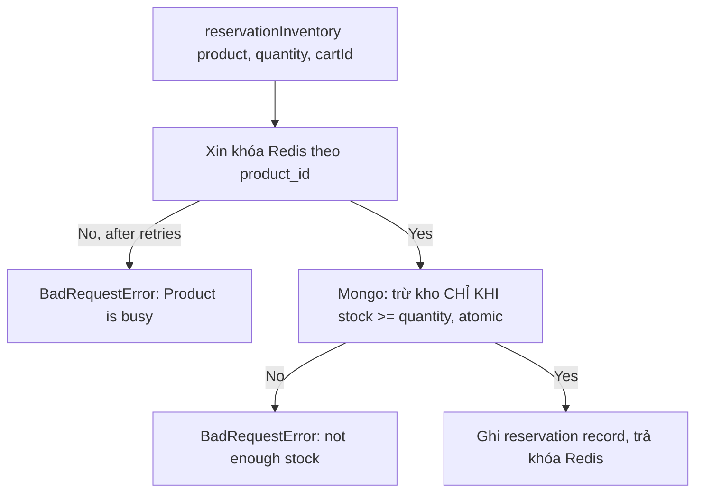

# Inventory

## 1. Lịch sử thay đổi

| Ngày       | Thay đổi                                                                                  | Vì sao                                                                                                          |
| ---------- | ----------------------------------------------------------------------------------------- | --------------------------------------------------------------------------------------------------------------- |
| 2026-08-19 | Thêm khóa Redis (`redisLock.js`) trước khi trừ kho                                        | Điều kiện atomic trong Mongo đủ an toàn cho 1 instance, nhưng cần khóa dùng chung khi có nhiều server song song |
| 2026-08-17 | Thêm `releaseInventory` (hoàn kho)                                                        | Cần hoàn tồn kho khi checkout rollback và khi hủy đơn                                                           |
| 2026-08-17 | Tạo `inventory.model.js`, `reservationInventory` với điều kiện atomic `stock >= quantity` | Cần cơ chế giữ chỗ tồn kho không bị bán vượt khi nhiều request cùng lúc                                         |

## 2. Luồng hoạt động

`releaseInventory` (hoàn kho): cộng lại `quantity`, xóa reservation record
khớp `cartId` — không qua khóa Redis.

## 3. Ghi chú

- Trừ kho có 2 lớp bảo vệ chồng nhau vì đây là nơi duy nhất có nguy cơ
  bán vượt tồn kho khi nhiều request cùng lúc:
  - **Khóa Redis** (chủ động, xin quyền trước khi làm gì) — cần thiết
    khi có nhiều server chạy song song, vì khóa Redis dùng chung được
    giữa các máy còn transaction Mongo trên 1 máy thì không.
  - **Điều kiện atomic trong Mongo** (bị động, tự phát hiện lúc ghi) —
    lớp bảo vệ cuối cùng, đúng dù khóa Redis có lỗi hay hết hạn hay
    không.
- Hoàn kho không cần khóa vì cộng thêm số lượng luôn an toàn, không có
  nguy cơ race condition như trừ kho.
- `inventory_reservations` là `Array` generic, không có sub-schema strict
  — mỗi phần tử `{quantity, cartId, createdOn}`.
- Khóa Redis có TTL 10s, retry tối đa 10 lần cách nhau 50ms.

## 4. Liên kết và tham khảo

- `src/services/inventory.service.js`
- `src/models/repositories/inventory.repo.js`
- `src/models/inventory.model.js`
- `src/helpers/redisLock.js`

Không có controller/route riêng — domain này không lộ ra ngoài qua HTTP
trực tiếp, chỉ được domain khác gọi nội bộ (ngoại trừ route
`/product/inventory/reservation` ở Product).

**Được gọi bởi:**

- `Product` — `addStockToInventory` (lúc tạo sản phẩm), `reservationInventory` (qua route reserve thủ công)
- `Checkout` — `reservationInventory`, `releaseInventory` (lúc rollback)
- `Order` — `releaseInventory` (lúc hủy đơn)
