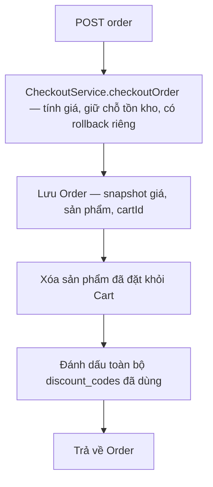
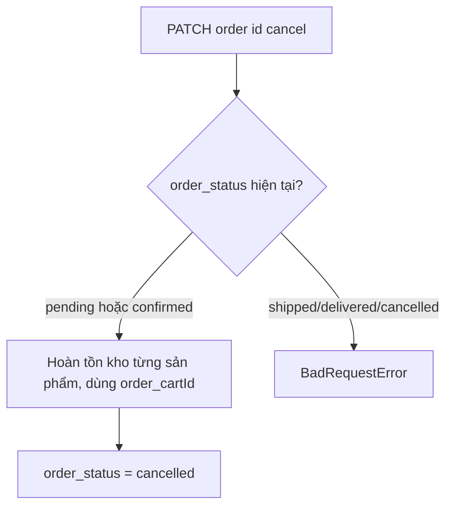
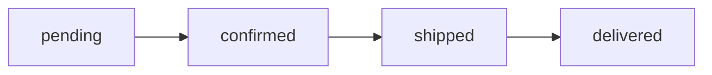

# Order

## 1. Lịch sử thay đổi

| Ngày       | Thay đổi                                                                                   | Vì sao                                                                |
| ---------- | ------------------------------------------------------------------------------------------ | --------------------------------------------------------------------- |
| 2026-08-19 | Thêm `updateOrderStatus` (pending→confirmed→shipped→delivered, không nhảy cóc)             | Cần theo dõi tiến trình vận chuyển đơn                                |
| 2026-08-19 | Thêm `cancelOrder` — hoàn tồn kho, chỉ cho phép khi `pending`/`confirmed`                  | Đơn tạo xong trước đó không có cách nào hủy, tồn kho bị giữ vĩnh viễn |
| 2026-08-19 | Tạo `order.model.js`, `orderByUser` (gọi Checkout, lưu Order, dọn Cart, đánh dấu Discount) | Đây là bước thật sự lưu đơn hàng, hoàn thiện luồng mua                |

## 2. Luồng hoạt động

| Method | Path                       | Auth |
| ------ | -------------------------- | ---- |
| POST   | `/v1/api/order`            | có   |
| GET    | `/v1/api/order`            | có   |
| GET    | `/v1/api/order/:id`        | có   |
| PATCH  | `/v1/api/order/:id/cancel` | có   |
| PATCH  | `/v1/api/order/:id/status` | có   |

**Tạo đơn:**

**Hủy đơn:**

**Đổi trạng thái:**

## 3. Ghi chú {#mismatch-discount}

- Tồn kho phải giữ chỗ **thành công trước** rồi mới lưu Order — nếu lưu
  Order trước mà tồn kho fail sau, sẽ có đơn hàng "ma" không có hàng
  thật đứng sau nó.
- Chỉ hủy được khi `pending`/`confirmed` — khi đã `shipped`/`delivered`,
  hàng đã rời kho thật, hủy qua API không còn ý nghĩa nghiệp vụ nên bị
  chặn ở tầng service.
- `updateOrderStatus` chỉ cho phép đi tới đúng bước kế tiếp liền kề,
  không nhảy cóc, không lùi — `cancelled` cố ý không nằm trong dây
  chuyền này vì hủy là nhánh riêng, tách khỏi luồng vận chuyển bình
  thường (đơn đã cancelled sẽ luôn từ chối mọi update status tiếp theo,
  đây là chủ đích).
- **Mismatch discount**: Checkout tính tiền giảm theo `discount_codes[0]`
  (mã đầu tiên), nhưng Order đánh dấu toàn bộ mảng `discount_codes` là đã
  dùng. Nếu client gửi nhiều hơn 1 mã: số tiền giảm chỉ tính theo mã đầu,
  nhưng lượt dùng của các mã còn lại vẫn bị trừ dù không ảnh hưởng gì tới
  giá.
- `order_status` có `'cancelled'` trong enum model nhưng không nằm trong
  dây chuyền `updateOrderStatus` ở trên (chủ đích, xem trên).

## 4. Liên kết và tham khảo

- `src/services/order.service.js`
- `src/models/repositories/order.repo.js`
- `src/models/order.model.js`
- `src/controllers/order.controller.js`
- `src/routes/order/index.js`

**Được gọi bởi:** không domain nào — đây là điểm cuối luồng mua hàng.
