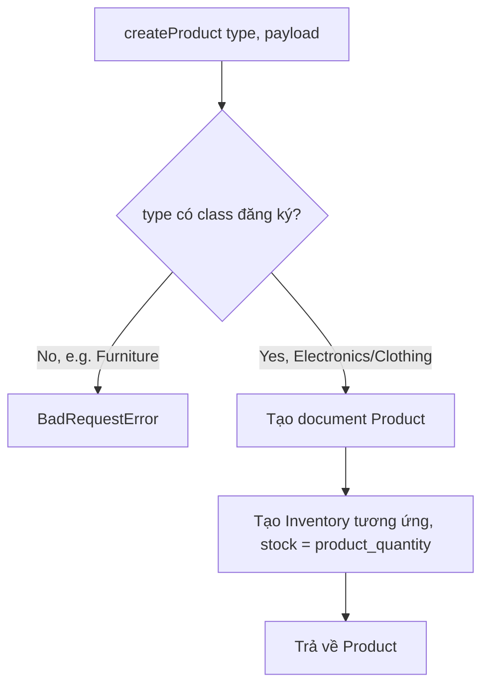
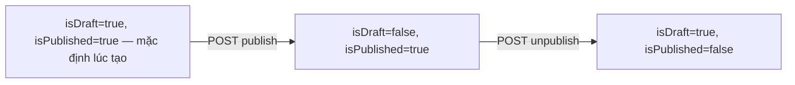

# Product

## 1. Lịch sử thay đổi

| Ngày       | Thay đổi                                                                                                   | Vì sao                                                           |
| ---------- | ---------------------------------------------------------------------------------------------------------- | ---------------------------------------------------------------- |
| 2026-08-18 | Thêm `updateProduct` (PATCH)                                                                               | Cần sửa sản phẩm sau khi tạo, không chỉ tạo mới                  |
| 2026-08-18 | Thêm publish/unpublish, search, findAllProducts, findProduct                                               | Hoàn thiện vòng đời hiển thị sản phẩm công khai                  |
| 2026-08-18 | Đổi `createProduct` để tự gọi `InventoryService.addStockToInventory`                                       | Sản phẩm mới tạo phải có tồn kho ngay, tránh phải gọi API riêng  |
| 2026-08-17 | Tạo `product.model.js` dùng Mongoose discriminator (Electronics, Clothing) + Factory pattern trong service | Nhiều loại sản phẩm có field riêng nhưng dùng chung 1 collection |

## 2. Luồng hoạt động

| Method | Path                                    | Auth  |
| ------ | --------------------------------------- | ----- |
| POST   | `/v1/api/product`                       | có    |
| PATCH  | `/v1/api/product/:id`                   | có    |
| GET    | `/v1/api/product/draft/all`             | có    |
| POST   | `/v1/api/product/publish/:id`           | có    |
| POST   | `/v1/api/product/unpublish/:id`         | có    |
| GET    | `/v1/api/product/search/:keySearch`     | không |
| GET    | `/v1/api/product/all`                   | không |
| GET    | `/v1/api/product/:id`                   | không |
| POST   | `/v1/api/product/inventory/reservation` | có    |

**Tạo sản phẩm:**

**Chuyển trạng thái publish:**

## 3. Ghi chú

- Tạo sản phẩm luôn kéo theo tạo Inventory trong cùng luồng — không tách
  bước riêng, vì sản phẩm không có tồn kho thì không bán được.
- `isDraft` và `isPublished` không tự loại trừ nhau — cả hai mặc định
  `true` khi tạo mới, phải gọi đúng API `publish`/`unpublish` để đồng bộ.
  Các API công khai lọc theo `isPublished: true`, nên sản phẩm mới tạo
  thực chất đã hiển thị công khai ngay dù `isDraft` vẫn `true`.
- `product_slug` tự tính lại trong `pre('save')` mỗi lần lưu — đổi tên
  sản phẩm thì slug tự đổi theo, không cần gọi gì thêm.
- `product_type` enum có `'Furniture'` nhưng chưa có class xử lý loại
  này — tạo sản phẩm loại đó sẽ luôn báo lỗi "Invalid product type".
- `findProduct` (Checkout dùng) chỉ trả về sản phẩm đã `isPublished:true`
  — kể cả chủ shop cũng không xem được draft qua đường này.

## 4. Liên kết và tham khảo

- `src/services/product.service.js`
- `src/models/repositories/product.repo.js`
- `src/models/product.model.js`
- `src/controllers/product.controller.js`
- `src/routes/product/index.js`

**Được gọi bởi:**

- `Checkout` — gọi thẳng `product.repo.js#findProduct` (bỏ qua service),
  lấy giá thật khi review/tạo đơn
