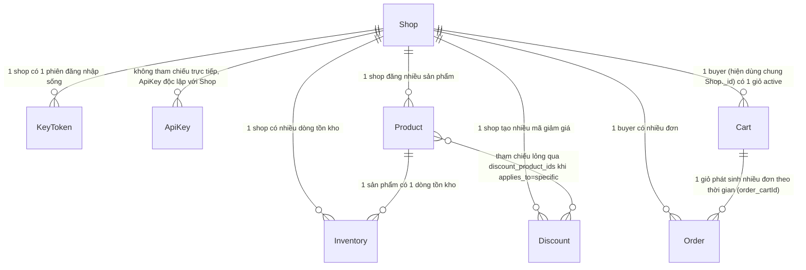

# Database

## 1. Lịch sử thay đổi schema

| Ngày       | Entity             | Thay đổi                                                                           | Vì sao                                                                    |
| ---------- | ------------------ | ---------------------------------------------------------------------------------- | ------------------------------------------------------------------------- |
| 2026-08-19 | `Order`            | Thêm `order_cartId`                                                                | Cần lưu lại giỏ hàng gốc để hoàn tồn kho đúng chỗ khi hủy đơn             |
| 2026-08-19 | `Inventory`        | Thêm `inventory_reservations[]`                                                    | Cần theo dõi từng lượt giữ chỗ theo `cartId` để có thể hoàn tác từng phần |
| 2026-08-18 | `Discount`         | Tạo entity mới                                                                     | Cần lưu mã giảm giá theo shop                                             |
| 2026-08-17 | `Cart`             | Tạo entity mới                                                                     | Cần lưu giỏ hàng trước khi checkout                                       |
| 2026-08-17 | `Inventory`        | Tạo entity mới                                                                     | Cần theo dõi tồn kho riêng khỏi `Product`                                 |
| 2026-08-17 | `Product`          | Tách thành entity gốc + 2 entity con (Electronics, Clothing) dùng chung tham chiếu | Nhiều loại sản phẩm có field riêng nhưng cần truy vấn chung được          |
| 2026-08-13 | `KeyToken`         | Đổi tên entity từ `Key` → `KeyToken`                                               | Tên cũ quá chung chung, không rõ dùng để làm gì                           |
| 2026-08-12 | `ApiKey`           | Tạo entity mới                                                                     | Cần lớp xác thực client tách khỏi xác thực Shop                           |
| 2026-08-11 | `Shop`, `KeyToken` | Tạo 2 entity đầu tiên                                                              | Khởi tạo luồng đăng ký/đăng nhập                                          |

## 2. Sơ đồ quan hệ

`ApiKey` không tham chiếu tới `Shop` — nó xác thực client gọi API, không
gắn với 1 shop cụ thể (xem [access.md](../api/access.md)).

Entity nào thuộc domain nghiệp vụ nào, xem file tương ứng trong
`docs/api/`.

## 3. Invariant xuyên entity

- `Cart.cart_userId` và `Order.order_userId` hiện tham chiếu tới
  `Shop._id` — hệ thống chưa có entity `User` tách riêng khỏi `Shop`
  (buyer và seller đang dùng chung 1 entity). Field này không có `ref`
  khai báo tường minh trong schema, chỉ là quy ước code phải tự giữ
  đúng.
- `Order.order_cartId` phải trỏ đúng `Cart` đã sinh ra đơn đó — dùng lại
  khi hủy đơn để hoàn tồn kho đúng `cartId`. Không có ràng buộc DB nào
  ép field này khớp với 1 `Cart` còn tồn tại; nếu `Cart` bị xóa (hiện
  code không xóa Cart bao giờ), tham chiếu này sẽ treo.
- `Discount.discount_product_ids` chỉ có ý nghĩa khi
  `discount_applies_to = 'specific'` — không có ràng buộc DB nào ép các
  giá trị trong mảng phải là `Product._id` hợp lệ đang tồn tại.
- `Inventory.inventory_reservations[].cartId` không phải tham chiếu
  chính thức tới `Cart._id` bằng kiểu `ObjectId` có `ref` — chỉ là giá
  trị dùng để nhóm/tra khi hoàn tác (`releaseInventory`), so khớp bằng
  giá trị thô.
