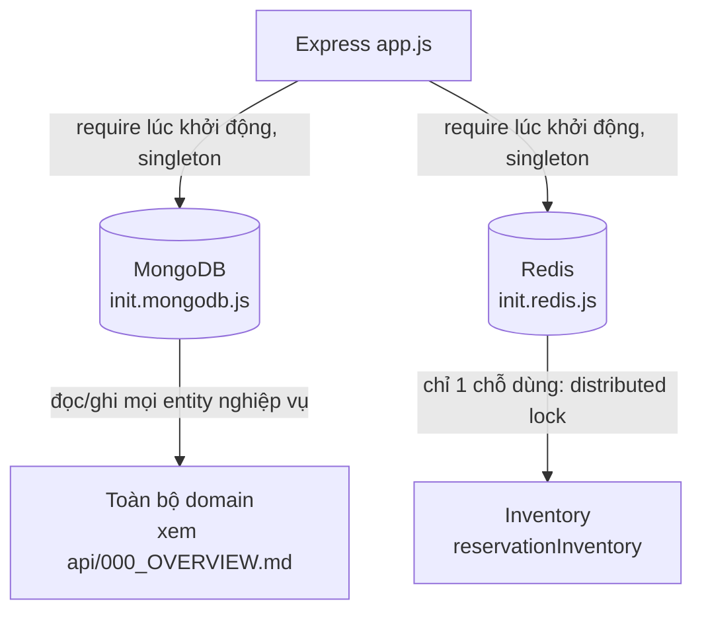

# Topology

## 1. Lịch sử thay đổi

| Ngày       | Thay đổi                                             | Vì sao                                                     |
| ---------- | ---------------------------------------------------- | ---------------------------------------------------------- |
| 2026-08-19 | Thêm Redis vào `app.js` (`init.redis`)               | Cần distributed lock cho tồn kho, xem [redis.md](redis.md) |
| 2026-08-11 | MongoDB là kết nối hạ tầng đầu tiên (`init.mongodb`) | Data store chính                                           |

## 2. Sơ đồ kết nối

Domain nào gọi domain nào ở tầng nghiệp vụ, xem
[api/000_OVERVIEW.md](../api/000_OVERVIEW.md) — sơ đồ đó khác sơ đồ
này: đây là hạ tầng, sơ đồ kia là nghiệp vụ.

## 3. Ghi chú

- Cả 2 kết nối được `require` ngay khi `app.js` load (không lazy), theo
  đúng thứ tự Mongo trước Redis — thứ tự này không quan trọng về mặt
  logic (2 kết nối độc lập), chỉ là thứ tự viết code.
- Redis hiện chỉ có **1 điểm dùng duy nhất** trong toàn hệ thống
  (`Inventory`) — không phải hạ tầng dùng chung rộng như MongoDB.
- Không có health-check tổng hợp kiểm tra cả 2 kết nối cùng lúc — mỗi
  kết nối tự log trạng thái riêng (xem [mongodb.md](mongodb.md),
  [redis.md](redis.md)).

## 4. Liên kết và tham khảo

- `src/app.js`
- `src/dbs/init.mongodb.js`
- `src/dbs/init.redis.js`
